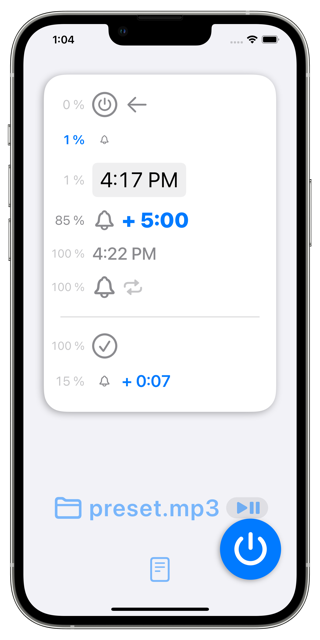
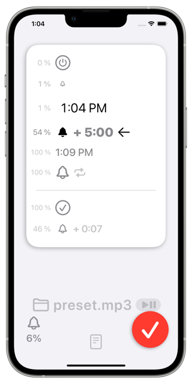

`アプリプロモーションページ簡易版`

_アプリ名_
========
_キャッチコピー_

概要
----
### オプション

---

仕様
----
### 価格
無料

### アプリ内課金
広告を非表示にする(160円)

### プラットフォーム
- iOS 16.0 以降
- iPadOS 16.0 以降

### サポート言語
- 日本語
- 英語

### AppStore URL
https://apps.apple.com/app/id