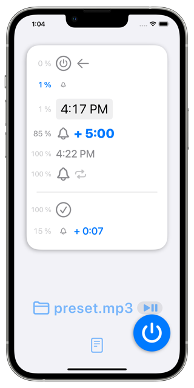

FadeInAlarm
===========
少しずつ音量が大きくなるアラームアプリ


[](https://apps.apple.com/app/id1465336070)




概要
----
任意の時刻になるとゆったりと少しずつ音量が大きくなるアラームアプリ。
### オプション
#### フェードイン時間
- 0:10
- 0:30
- 1:00
- 5:00
- 30:00
- 1:00:00
#### フェードアウト時間
- 0:03
- 0:07
- 0:15
- 0:30
- 1:00
#### 待機中の音量
- 10%
- 5%
- 3%
- 1%
- 0%
### 必須事項
音声ファイル(mp3など)をインポートしてください。
### 注意事項
事前にアプリを起動させておく必要があります。

デモビデオ
--------
https://www.youtube.com/watch?v=d66thA-K5Dg

操作方法
-------

仕様
----
### 価格
160円
### アプリ内課金
なし
### プラットフォーム
- iOS 15.2 以降
- iPadOS 15.2 以降
### サポート言語
- 英語
- 日本語

よくある質問/よくありそうな質問
--------------------------

制限事項
-------

バージョン情報
------------
### 2.1
_2022年05月10日_
### 2.0.1
_2022年03月21日_
### 2.0
_2022年02月25日_
### 1.0
_2019年05月26日_

ソースコード
----------
https://github.com/FlipByBlink/FadeInAlarm_v2

問い合わせ/連絡先
---------------
sear_pandora_0x@icloud.com

デベロッパー/パブリッシャー
-----------------------
### 組織構成
個人系
### 名前
山下亮(1人のみ)

---

プライバシーポリシー
-----------------
_2022-04-21_
### Japanese
このアプリ自身において、ユーザーの情報を一切収集しません。
### English
This application don't collect user infomation.

---

#### 本ページの更新日時
2022-11-07

---


```
## Description
Alarm clock with taking a long time from small volume to max volume.

### OPTIONS
#### Hour fade-in
- 0:10
- 0:30
- 1:00
- 5:00
- 30:00
- 1:00:00

#### Hour fade-out
- 0:03
- 0:07
- 0:15
- 0:30
- 1:00

#### Volume on waiting
- 10%
- 5%
- 3%
- 1%
- 0%

### REQUIRED
Import your favorite audio file such as mp3.

### NOTICE
App must be launched beforehand in advance.
```
