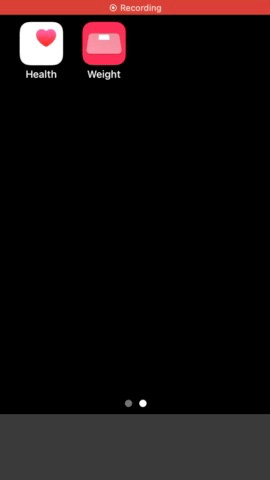

# iPhone App TapWeight / 体重登録 for "Health"

## Description
This application is designed to register weight data to the Apple "Health" application pre-installed on iPhone in the fastest possible way (as manual).

People frequently measure their weight and body fat percentage daily using a scale. Many iPhone users register their weight and body fat percentage data on "Health" app. The best solution is to use a smart scale that works with "Health" app and automatically stores measurements, but they are expensive and inaccessible. Manual data registration is possible in "Health" app, but "Health" app is not designed for daily manual data registration. Therefore, manually entering data that occur continuously daily, such as weight measurements, is a very time-consuming and stressful experience. This app was developed to solve such problems.

This app cannot read, view, or manage past data in "Health" app. This app is intended only to register data to the "Health" app. Please check the registered data on the "Health" app.

### Target / Use-case
- No "smart" scale.

- Frequently measure my weight (and body fat percentage) using a scale almost every day.

- Intend to register the data into "Health" app every time, after measuring by a scale.

### Option
- Unit: kg, lbs, st

- 100g/50g amount option.

- With body mass index automatically.

- With body fat percentage.

- Function to change the registration date and time

- Option to hide AD banner. (In-App-Purchase)

### Others
- Launch "Health" app by one tap.

- Cancel feature just after registration.

- Local history for the purpose of "operation check" / "temporary backup".

- Check source code in app.

- All feature is free.

- AD banner of apps by TapWeight developer.

## Source code link
[github.com/FlipByBlink/TapWeight](https://github.com/FlipByBlink/TapWeight)

### Source code (Mirror) link
[gitlab.com/FlipByBlink/TapWeight_Mirror](https://gitlab.com/FlipByBlink/TapWeight_Mirror)

## Contact
sear_pandora_0x@icloud.com

------

## Privacy Policy for AppStore
2022-05-22

### Japanese
このアプリ自身において、ユーザーの情報を一切収集しません。

### English
This application don't collect user infomation.

------

<!-- URL "Support page for AppStore" -->
<!-- https://flipbyblink.github.io/TapWeight/ -->

<!-- URL "Privacy Policy for AppStore" -->
<!-- https://github.com/FlipByBlink/TapWeight#privacy-policy-for-appstore -->