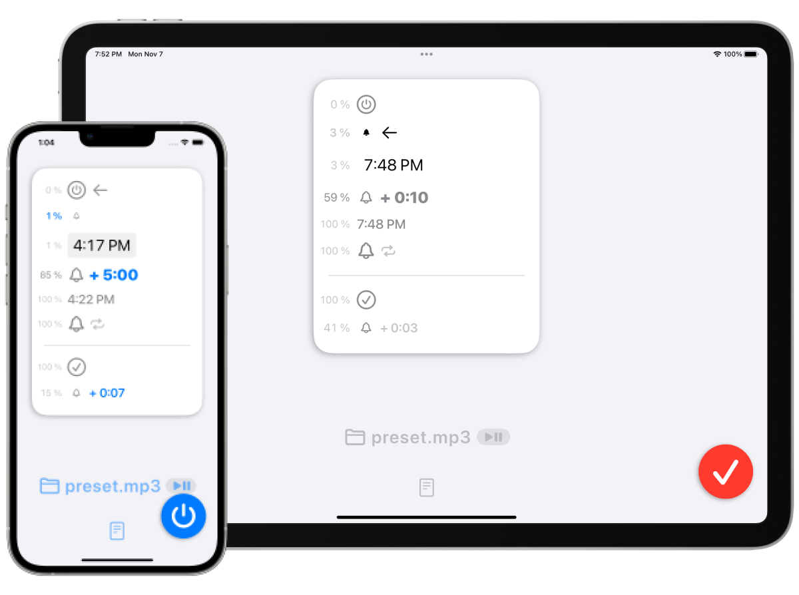

FadeInAlarm / フェードインアラーム
===============================
少しずつ音が大きくなるアラームアプリ

概要
--------------------------------
普通のアラームアプリでは大きな警告音が勢いよく鳴りますが、このアプリではゆったりと少しずつ音量が大きくなることによってあなたに任意の時刻をお知らせします。

数十秒から数十分といった長い時間をかけて音量を少しずつ大きくすることができます。

### オプション
#### フェードイン時間
- 10秒
- 30秒
- 1分
- 5分
- 30分
- 1時間

#### フェードアウト時間
- 3秒
- 7秒
- 15秒
- 30秒
- 1分

#### 待機中の音量
- 10%
- 5%
- 3%
- 1%
- 0%

### 必須事項
アラーム音声としてmp3などの音源ファイルをユーザー自身で用意してインポートしてください。ユーザーが停止ボタンを押すまでアプリはアラーム音声を繰り返し再生します。

動作確認用の音声データはアプリ内にプリセットされています。

### 注意事項
一般的なアラームアプリとは違い、このアプリでは諸事情により、アプリ自身が全く起動していない状態からアラームを鳴らすことはできません。事前にアプリを起動する必要があります。

例えば、目覚まし目的で朝6時にアラームを鳴らしたい場合、就寝する直前にこのアプリを立ち上げて起動ボタンを押してください。

デモビデオ
---------------------------------------------
<video controls width="200" src="preview.mp4">
      Sorry, your browser doesn't support embedded videos.
</video>

仕様
-------
### 価格
160円

### アプリ内課金
なし

### プラットフォーム
- iOS 15.2 以降
- iPadOS 15.2 以降

### サポート言語
- 英語
- 日本語

### 問い合わせ / 連絡先
sear_pandora_0x@icloud.com

### デベロッパー / パブリッシャー
#### 組織構成
個人系

#### 名前
山下亮(1人のみ)

バージョン情報
------------
### 2.1
_2022年05月10日_
<pre>UIデザインの再設計
主要機能の変更は無し
アラーム音源確認機能の追加
ソースコードをアプリ内で確認する機能を追加
その他、細かな改善をいくつか実施</pre>

### 2.0.1
_2022年03月21日_
<pre>UIの調整のみ。
機能面の変更は無し。</pre>

### 2.0
_2022年02月25日_
<pre>リニューアルアップデートしました</pre>

### 1.0
_2019年05月26日_

ソースコードを公開しています
---------------------------------------
[github.com/FlipByBlink/FadeInAlarm_v2](https://github.com/FlipByBlink/FadeInAlarm_v2)

***

プライバシーポリシー
-----------------
_2022-04-21_

### Japanese
このアプリ自身において、ユーザーの情報を一切収集しません。

### English
This application don't collect user infomation.
