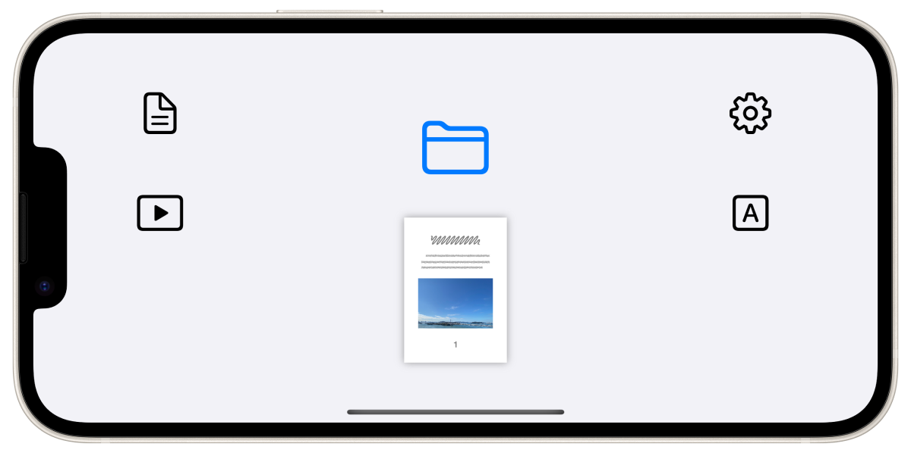

FlipByBlink
==================
わずかに長い瞬きでページめくりできる電子書籍アプリ

概要
----------
- シンプルで一般的な電子書籍リーダー(固定レイアウト向け)
- 特殊な機能は1つだけ。目を閉じる時間を意識的にわずかに長くさせた瞬きでページめくりをします
- PDFファイルに対応
- カメラであなたの瞬きを認識

### 想定対象ユーザー
固定レイアウト方式の電子書籍を読むすべての人

### ユースケース
- 一般的な読書
- 楽譜を見ながら楽器を演奏
- レシピ本を確認しながら料理
- 電車やバスでの読書
- 身体障害を抱える方の読書
- など

仕様
-------
### 価格
無料

### アプリ内課金
なし

### プラットフォーム
- iOS 14.7 以降
- iPadOS 14.7 以降

### サポート言語
- 日本語
- 英語

### 問い合わせ
sear_pandora_0x@icloud.com

### デベロッパー / パブリッシャー
<table>
<tr>
<th>組織構成</th>
<td>個人系</td>
</tr>
<tr>
<th>人数</th>
<td>1人</td>
</tr>
<tr>
<th>名前</th>
<td>山下亮</td>
</tr>
</table>

### バージョン
3.0.2
