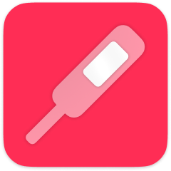

TapTemperature / 体温登録
=============================
Apple「ヘルスケア」アプリに体温を最速で登録しよう

概要
-----------------
iPhoneにプリインストールされているApple「ヘルスケア」アプリに体温データを(手動としては)最速で登録するためのアプリです。

このアプリでは「ヘルスケア」アプリ上の過去のデータの読み込みや閲覧、管理等は出来ません。このアプリは「ヘルスケア」アプリへのデータ登録のみを目的としています。登録したデータは「ヘルスケア」アプリ上で確認してください。

### 想定ユーザー / ユースケース
- スマート体温計を持っていない。
- 日常的に体温(か基礎体温)を体温計で計測している。
- 普通の体温計で測定した直後、毎回手動で測定結果を「ヘルスケア」アプリに登録する事を検討している。

### オプション
- 単位: ℃, ℉
- 基礎体温モード。
- 小数点以下2桁モード。
- 数字入力だけで自動的に完了する機能。
- 広告バナー非表示オプション。(アプリ内課金)

### その他
- このアプリ内からApple「ヘルスケア」アプリをワンタップで立ち上げ可能。
- 動作確認や簡易バックアップを想定した端末内での履歴機能。
- データ登録直後にワンタップで登録取り消しする機能。
- アプリ内でアプリ自身のソースコードを確認できる機能。
- すべての機能を無料で利用できます。
- 自作アプリに関するバナー広告を表示します。

### 背景
人々は体温計を用いて体温(や基礎体温)は日々頻繁に計測します。多くのiPhoneユーザーは「ヘルスケア」アプリ上に体温(や基礎体温)のデータを登録しています。「ヘルスケア」アプリと連携して自動的に計測データを保存してくれるスマート体温計を用いることが最高の解決策ではありますが、それらは高価であったり入手性が低かったりします。「ヘルスケア」アプリ上で手動でもデータ登録は可能ですが、残念ながら「ヘルスケア」アプリは計測データを日常的に手動で登録することを想定されていません。そのため、体温測定のような日々継続的に発生するデータを手動で入力することは大いに手間が掛かりストレスフルな体験になります。そうした課題を解決するためにこのアプリは開発しました。

* * *

仕様
-------
### 価格
無料

### アプリ内課金
広告を非表示にする(160円)

### プラットフォーム
- iOS 16.0 以降

### サポート言語
- 日本語
- 英語

### 問い合わせ
sear_pandora_0x@icloud.com

### デベロッパー / パブリッシャー
<table>
<tr>
<th>組織構成</th>
<td>個人系</td>
</tr>
<tr>
<th>人数</th>
<td>1人</td>
</tr>
<tr>
<th>名前</th>
<td>山下亮</td>
</tr>
</table>

バージョン履歴
------------
### 1.0.2
_2022年09月20日_
<pre>メイン単語のローカライズ(体温/基礎体温/ヘルスケア)を追加。
最新開発環境(iOS16)でビルドしました。</pre>

### 1.0.1
_2022年06月30日_
<pre>- 広告バナーの追加
- 広告バナー非表示オプション(アプリ内課金)を追加
- リファクタリング</pre>

### 1.0
_2022年05月31日_
