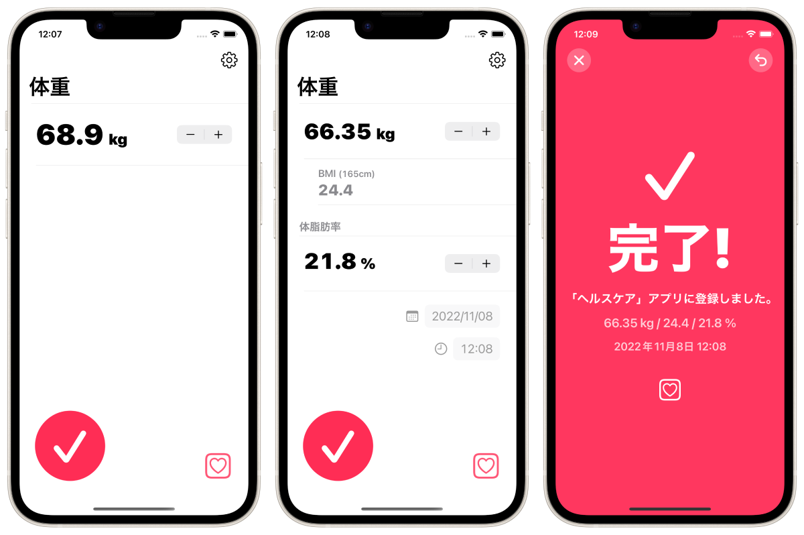

TapWeight / 体重登録
==================================
「ヘルスケア」アプリに体重データを最速で登録しよう

概要
--------------------
iPhoneにプリインストールされているApple「ヘルスケア」アプリに体重データを(手動としては)最速で登録するためのアプリです。

### 想定ユーザー / ユースケース
- スマート体重計を持っていない。
- 日常的に体重や体脂肪率を体重計で計測している。
- 体重計で測定した直後、毎回手動で測定結果を「ヘルスケア」アプリに登録する事を検討している。

### オプション
- 計測単位
  - kg キログラム
  - lbs ポンド
  - st ストーン
- 入力単位を100gから50gへ変更可能
- BMIを自動的に計算して同時に登録可能
- 体脂肪率も同時に登録可能
- 登録日時を変更できる機能

### その他
- このアプリ内からApple「ヘルスケア」アプリをワンタップで立ち上げ可能
- 登録直後に登録を取り消し可能
- 動作確認や簡易バックアップを想定した端末内での履歴機能

### 注意
このアプリでは「ヘルスケア」アプリ上の過去のデータの読み込みや閲覧、管理等は出来ません。このアプリは「ヘルスケア」アプリへのデータ登録のみを目的としています。登録したデータは「ヘルスケア」アプリ上で確認してください。

### 背景
人々は体重計を用いて体重や体脂肪率は日々頻繁に計測します。そして、多くのiPhoneユーザーは「ヘルスケア」アプリ上に体重や体脂肪率のデータを登録しています。

「ヘルスケア」アプリと連携して自動的に計測データを保存してくれるスマート体重計を用いることが最高の解決策ではありますが、それらは高価であったり入手性が低かったりします。「ヘルスケア」アプリ上で手動でもデータ登録は可能ですが、残念ながら「ヘルスケア」アプリは計測データを日常的に手動で登録することを想定されていません。そのため体重測定のような日々継続的に発生するデータを手動で入力することは大いに手間が掛かりストレスフルな体験になります。

そうした課題を解決するためにこのアプリを開発しました。

仕様
-------
### 価格
無料

### アプリ内課金
広告を非表示にする(160円)

### プラットフォーム
- iOS 15.0 以降

### サポート言語
- 全て
  - 日本語
  - 英語
- 主要3単語(体温/基礎体温/ヘルスケア)のみ翻訳
  - 中国語 簡体字
  - 中国語 繁体字
  - スペイン語
  - ポルトガル語
  - ロシア語
  - インドネシア語
  - フランス語
  - アラビア語
  - ドイツ語
  - 韓国語
  - ウクライナ語

### 問い合わせ
sear_pandora_0x@icloud.com

### デベロッパー / パブリッシャー
<table>
<tr>
<th>組織構成</th>
<td>個人系</td>
</tr>
<tr>
<th>人数</th>
<td>1人</td>
</tr>
<tr>
<th>名前</th>
<td>山下亮</td>
</tr>
</table>

### バージョン
1.3.1
