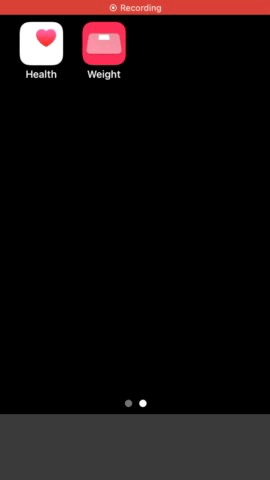

# Template markdown page

## Description
This application is designed to register weight data to the Apple "Health" application pre-installed on iPhone in the fastest possible way (as manual).

## Source code link
[link](https://github.com/zwamr6aln/zwamr6aln.github.io)

---

## Contact
sear_pandora_0x@icloud.com
